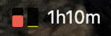
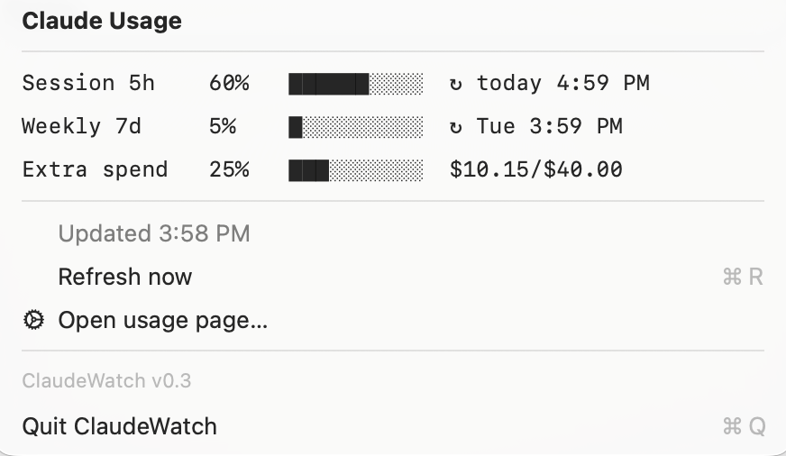

# claude-watch

A tiny macOS menu-bar widget for keeping an eye on your Claude Pro/Max
subscription usage — the same numbers shown at
[claude.ai/settings/usage](https://claude.ai/settings/usage), without opening a
browser.

## What it shows

In the menu bar: **two vertical flood bars** (left = current 5-hour session,
right = rolling 7-day weekly) that fill from the bottom as usage grows — dark
yellow normally, switching to red once a window passes 60% — plus a compact
countdown (e.g. `2h33m`) to the next 5-hour reset.

Here it is sitting in the menu bar:



The tall **red** bar on the left shows that I've used a large part of my limit
for the current 5-hour window (which resets in 1 hour and 10 minutes — the
`1h10m` countdown beside it). The tiny **yellow** bar (the rolling 7-day
weekly window) shows that I've used almost none of my weekly limit.

Click it for a popup with the exact figures:



It refreshes in the background every 15 minutes, whenever you open the menu, when
the Mac wakes from sleep, and the moment a 5-hour window resets (so the countdown
never sticks on `now`); the countdown ticks every minute. It remembers the last
reading across restarts, so it shows your figures right away — flagged if stale —
instead of a blank while the first fetch runs. It watches the
network too (handy on a laptop): while you're offline it doesn't pester the API —
it keeps your last-good bars and notes **⚠ No network — last good HH:MM** — and
it re-fetches the instant you reconnect. The usage endpoint shares a small
rate-limit bucket with Claude Code and anything else using the same login, so on
an HTTP 429 the widget backs off (exponentially, up to an hour) instead of
hammering it, and marks stale figures **⚠ API busy — last good HH:MM** rather
than passing them off as current. The icon adapts to the menu
bar; the title turns into a warning if the usage data can't be fetched. As your
Claude login nears expiry the popup warns
(**⚠ Login expires in NNm**) while it still works; once it has actually expired,
or a rejected-login keeps failing, the menu bar shows a red **⚠ login**. A
momentary token hiccup (Claude Code rotating the token, say) is ridden out
silently, keeping your last-good numbers, so the login plaque only appears when
you really need to sign in. In both cases the popup offers a **🔑 Log in to
Claude…** item that opens a Terminal running `claude auth login`, refreshing the
keychain token in place (reopening the app alone won't — it just re-reads
whatever token is already there).

## How it works

There is no official public API for consumer subscription usage. This app uses
the same **undocumented** endpoint that Claude Code's own `/usage` bar relies
on:

```
GET https://api.anthropic.com/api/oauth/usage
Authorization: Bearer <oauth access token>
```

The OAuth access token is read at runtime from wherever Claude Code stored it —
either the macOS **login keychain** (service `Claude Code-credentials`) or
**`~/.claude/.credentials.json`**, depending on your Claude Code version and
platform. ClaudeWatch checks both and uses whichever token is fresher; it never
stores the token itself. The JSON response contains `five_hour`, `seven_day`,
per-model windows, and an `extra_usage` block (whose dollar fields are in
**cents**).

> ⚠️ This relies on an undocumented endpoint and credential location, both of
> which can change without notice. Not affiliated with or endorsed by Anthropic.

## Requirements

- macOS with the Swift toolchain (`swiftc` — Command Line Tools or Xcode)
- An active Claude Code login on the same machine (Pro/Max subscription)

## Build & run

```sh
swiftc ClaudeWatch.swift -o claude-watch -framework Cocoa
./claude-watch
```

The first run may prompt for keychain access — choose **Always Allow**.

## Install & start at login

```sh
./install.sh
```

This builds `ClaudeWatch.app`, copies it to `~/Applications`, writes a
LaunchAgent (`~/Library/LaunchAgents/com.traviswheeler.claudewatch.plist`) with
`RunAtLoad` + `KeepAlive`, and loads it — so it runs now, starts at login, and
relaunches if it crashes. `build.sh` builds the `.app` bundle only.

To remove it:

```sh
launchctl bootout gui/$(id -u)/com.traviswheeler.claudewatch
rm -rf ~/Applications/ClaudeWatch.app ~/Library/LaunchAgents/com.traviswheeler.claudewatch.plist
```

## Updating

The widget checks for a new version on its own (at launch, every few hours, and
when you open the menu). When the checkout it was installed from is behind
`origin`, the popup shows a green **⬆ Update available** item — click it to
pull, rebuild, and relaunch in place. The check uses your existing git/SSH
access, so it needs no extra token even though the repo is private. The current
version is shown at the bottom of the menu.

You can also update by hand at any time:

```sh
./update.sh        # git pull --ff-only + ./install.sh
```

> `install.sh` records the path of the source checkout in the installed app
> bundle (`CWSourcePath` in `Info.plist`) so the app knows where to pull from —
> keep that checkout around for self-update to work.

## License

BSD 3-Clause — see [LICENSE](LICENSE).
